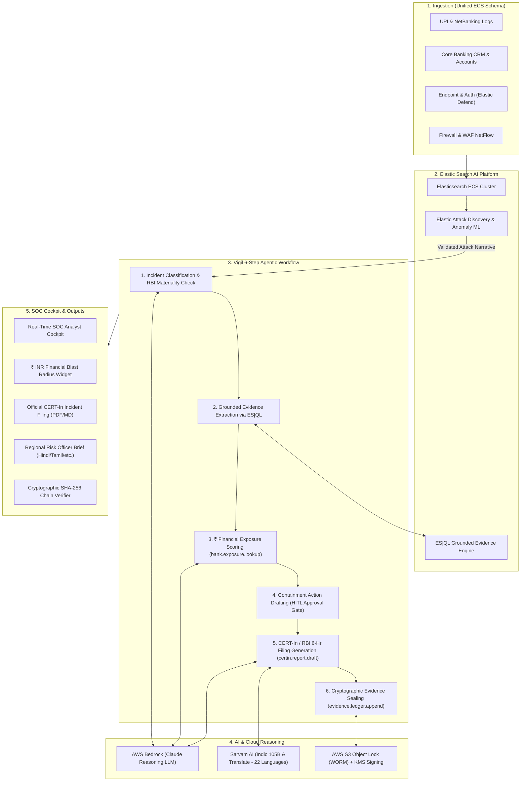

# 🛡️ VIGIL — AI Tier-1 SOC Analyst for Banks
### *From Alert Zero to a Regulator-Ready Incident File in Under 6 Hours*

> **Forge the Future Hackathon 2026** — *By Elastic Technologies India & AWS*  
> **Track 03**: Security & AI-Powered SOC / BFSI Vertical  
> **Submission ID**: `6a81eba4c333388e8191f1e8` (Shortlisted for Next Phase)

---

## 📌 Executive Summary

Under **CERT-In Directions (April 2022)** and the **RBI Cyber Security Framework**, Indian commercial banks must detect, investigate, contain, and report material cyber incidents within **6 hours of noticing**. 

Today, traditional SOCs suffer from two major bottlenecks:
1. **Alert Fatigue**: Thousands of disjointed alerts from firewalls, servers, and NetBanking.
2. **The Paperwork Nightmare**: Investigating an attack takes ~45 minutes, but calculating financial loss, compiling evidence, and writing the official regulatory report takes **4+ hours**.

**VIGIL** is an autonomous AI Tier-1 SOC analyst that builds on the **Elastic Search AI Platform** (Attack Discovery & ES|QL) and **AWS Bedrock**. When Elastic surfaces a validated attack narrative, Vigil automatically executes a deterministic 6-step workflow that:
- Quantifies financial risk in **Rupees (₹)** against core banking accounts.
- Recommends actionable containment with **Human-in-the-Loop** authorization.
- Generates the official **CERT-In Annexure-1 regulatory filing** in under **10 minutes**.
- Translates incident briefs into **22 Indic languages via Sarvam AI** for regional branch compliance staff.
- Seals every query, log, and decision into an **immutable, SHA-256 hash-chained evidence ledger**.

---

## 🏗️ Architecture & Data Flow

---

## 📚 Complete Project Documentation

| Document | Description |
| :--- | :--- |
| 📊 [**Pitch Deck & Presentation Guide**](file:///Users/nabeelzaidi/Downloads/elastic_hackathon/docs/PITCH_DECK.md) | Slide-by-slide pitch deck with visual layouts, metrics, and word-for-word speaker notes. |
| 🛠️ [**Developer & Engineering Guide**](file:///Users/nabeelzaidi/Downloads/elastic_hackathon/docs/DEVELOPMENT_GUIDE.md) | In-depth technical architecture, ECS schemas, ES\|QL query catalogue, and API contracts. |
| 🤝 [**Team Meeting Script & Roles**](file:///Users/nabeelzaidi/Downloads/elastic_hackathon/docs/TEAM_ALIGNMENT_AND_ROLES.md) | Word-for-word meeting script to pitch your team today, task allocation, and roadmap. |

---

## ⚡ Key Value Proposition & Differentiators

| Capability | Traditional Bank SOC | With VIGIL |
| :--- | :--- | :--- |
| **Investigation Time** | 45–60 minutes per incident | **< 5 minutes** via ES\|QL automated retrieval |
| **Regulatory Filing** | 4+ hours of manual drafting | **< 10 minutes** auto-generated CERT-In Annexure-1 form |
| **Risk Metric** | Abstract score (e.g., Host Risk: 85/100) | **₹-denominated business exposure** (e.g., ₹1.82 Crore at risk) |
| **Fraud + SOC Silo** | Disconnected teams (Fraud vs. Cyber) | **Unified ECS timeline** correlating UPI fraud with cyber intrusion |
| **Audit Defensibility** | Easily edited ticket notes | **SHA-256 hash-chained WORM ledger** independently verifiable |
| **Regional Inclusivity** | English-only dashboards | **Sarvam AI Indic briefs** for regional branch compliance officers |

---

## 🎯 Hackathon Judging Matrix Alignment

- **Technical Implementation (30%)**: Elasticsearch ECS schema, high-performance ES|QL queries, AWS Bedrock reasoning, and S3 Object Lock.
- **Innovation & AI (25%)**: Solves the 6-hour regulatory bottleneck; converges transaction fraud with cyber telemetry.
- **Impact & BFSI Relevance (20%)**: Directly targets Indian commercial bank compliance under CERT-In and RBI Master Directions.
- **User Experience (15%)**: Real-time SOC Analyst Cockpit with live 6-hour countdown, ₹ exposure cards, and 1-click containment.
- **Presentation & Demo (10%)**: End-to-end live attack scenario demonstrated in under 2 minutes.
