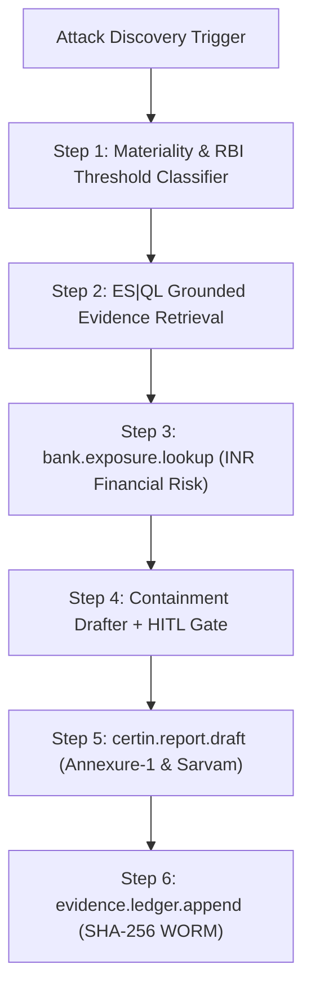

# 🛡️ VIGIL: Comprehensive Developer & Engineering Blueprint
### *End-to-End Implementation Architecture for the AI Tier-1 SOC Analyst for Indian BFSI*

> **Project**: VIGIL  
> **Hackathon**: Forge the Future 2026 — Elastic Technologies India & AWS  
> **Track**: Track 03: Security & AI-Powered SOC  
> **Submission ID**: `6a81eba4c333388e8191f1e8` (Shortlisted)

---

## 1. Executive Summary & Core Architectural Tenets

VIGIL is an autonomous AI Tier-1 SOC Analyst engineered for Indian Commercial Banks and Financial Institutions. Under **CERT-In Directions (April 2022)** and the **RBI Cyber Security Framework**, banks face a mandatory **6-hour regulatory reporting clock** from the moment a material cyber incident is noticed.

VIGIL bridges the gap between **Alert Zero** (triage) and **Filing Zero** (compliance):
1. **Never Rebuild Elastic**: Ingests through **Elastic Defend & Fleet**, utilizes **Elastic ML Anomaly Detection**, and consumes validated attack narratives directly from **Elastic Attack Discovery**.
2. **Business-Centric Risk Scoring**: Translates technical host/IP risk into **Rupee-denominated (₹) financial exposure** by cross-referencing Core Banking CRM, customer tiers (HNI vs. Corporate), and pending UPI batch settlements.
3. **Automated Regulatory Compliance**: Auto-generates the official **CERT-In Annexure-1 incident report** in under 10 minutes (saving 4+ hours of manual paperwork).
4. **Audit Defensibility**: Locks every query, log, reasoning step, and analyst approval into an immutable, **SHA-256 hash-chained evidence ledger** backed by **AWS S3 Object Lock (WORM)**.
5. **Multilingual Regional Access**: Integrates **Sarvam AI (105B & Translate)** to render incident briefs in 22 Indic languages for Tier-2/Tier-3 branch risk officers.

---

## 2. System Architecture & Component Interactions

```
┌─────────────────────────────────────────────────────────────────────────────────────────────────┐
│                                   1. TELEMETRY INGESTION (ECS)                                  │
│   • NPCI UPI / IMPS Gateway Logs      • Core Banking CRM Accounts     • Elastic Defend Endpoint │
│   • Fortinet / Palo Alto NetFlow      • Okta / Active Directory Logs   • CERT-In CIAD Threat Feed│
└────────────────────────────────────────────────┬────────────────────────────────────────────────┘
                                                 │
                                                 ▼
┌─────────────────────────────────────────────────────────────────────────────────────────────────┐
│                               2. ELASTIC SEARCH AI PLATFORM (CORE)                              │
│   • Elasticsearch Unified Cluster (ECS v8.11+ with BFSI Extensions)                            │
│   • Elastic ML Anomaly Jobs (UPI Spikes, Off-Hour Privileged Access)                            │
│   • Elastic Attack Discovery (Autonomous Triage -> Validated Attack Narrative Trigger)          │
│   • ES|QL Engine (Sub-second Piped Forensic Evidence Queries)                                   │
└────────────────────────────────────────────────┬────────────────────────────────────────────────┘
                                                 │ Validated Attack Narrative Trigger
                                                 ▼
┌─────────────────────────────────────────────────────────────────────────────────────────────────┐
│                         3. VIGIL 6-STEP DETERMINISTIC AGENTIC WORKFLOW                          │
│                                                                                                 │
│  ┌──────────────────────┐   ┌──────────────────────┐   ┌─────────────────────────────────────┐  │
│  │ Step 1: Materiality  │──▶│ Step 2: ES|QL Evidence│──▶│ Step 3: INR Financial Exposure     │  │
│  │ Check RBI Thresholds │   │ Query Logs & IoCs    │   │ bank.exposure.lookup (Rupee Impact) │  │
│  └──────────────────────┘   └──────────────────────┘   └──────────────────┬──────────────────┘  │
│                                                                           │                     │
│  ┌──────────────────────┐   ┌──────────────────────┐   ┌──────────────────▼──────────────────┐  │
│  │ Step 6: Seal Ledger  │◀──│ Step 5: CERT-In Form │◀──│ Step 4: Containment Action (HITL)  │  │
│  │ SHA-256 Hash Chain   │   │ certin.report.draft  │   │ 1-Click Analyst Authorization Gate  │  │
│  └──────────────────────┘   └──────────────────────┘   └─────────────────────────────────────┘  │
└───────────────────────┬──────────────────────────────────────────┬──────────────────────────────┘
                        │                                          │
                        ▼                                          ▼
┌────────────────────────────────────────────────┐  ┌─────────────────────────────────────────────┐
│       4. CLOUD REASONING & COMPLIANCE          │  │       5. SOC COCKPIT & DELIVERABLES         │
│ • AWS Bedrock (Claude 3.5 Sonnet / Haiku)      │  │ • Real-Time SOC Analyst Cockpit (React)     │
│ • Sarvam AI (Indic Multilingual Translation)   │  │ • 6-Hour Regulatory Clock Countdown Timer   │
│ • AWS S3 Object Lock (WORM) + KMS (ap-south-1) │  │ • Official CERT-In Annexure-1 PDF Exporter  │
│ • Immutable SHA-256 Cryptographic Ledger       │  │ • Interactive ES|QL Piped Query Terminal    │
└────────────────────────────────────────────────┘  └─────────────────────────────────────────────┘
```

---

## 3. Telemetry & ECS Schema Specification (BFSI Extensions)

Vigil normalizes all events into the **Elastic Common Schema (ECS v8.11+)**, augmented with banking fields under the `bank.*` namespace:

### Core Field Dictionary:

| Field Name | Type | Indexing | Description & Example |
| :--- | :--- | :--- | :--- |
| `@timestamp` | `date` | `true` | ISO 8601 event timestamp (`2026-09-02T19:24:00.120Z`) |
| `event.category` | `keyword` | `true` | `network`, `authentication`, `process`, `financial` |
| `event.type` | `keyword` | `true` | `start`, `access`, `denied`, `transaction`, `exfiltration` |
| `event.outcome` | `keyword` | `true` | `success`, `failure`, `blocked` |
| `source.ip` | `ip` | `true` | Source IP address of the request (`198.51.100.44`) |
| `destination.ip` | `ip` | `true` | Destination internal server IP (`10.0.4.12`) |
| `user.name` | `keyword` | `true` | Authenticated username or API identity (`svc_payment_gw`) |
| `user.roles` | `keyword` | `true` | Array of assigned roles (`["API_SERVICE", "PAYMENT_ADMIN"]`) |
| `threat.tactic.name` | `keyword` | `true` | MITRE ATT&CK tactic (`Privilege Escalation`, `Impact`) |
| `threat.technique.id` | `keyword` | `true` | MITRE technique ID (`T1078.004`, `T1059.004`) |
| `bank.account_id` | `keyword` | `true` | Core banking account number (`ACC-CORP-9921448`) |
| `bank.customer_tier` | `keyword` | `true` | Priority tier: `Corporate`, `HNI`, `Retail` |
| `bank.upi_vpa` | `keyword` | `true` | Virtual Payment Address (`merchant.bulk@yesbank`) |
| `bank.beneficiary_vpa` | `keyword` | `true` | Destination payment address (`rogue.payout@paytm`) |
| `bank.channel` | `keyword` | `true` | `UPI_GATEWAY`, `NETBANKING`, `IMPS`, `ATM_SWITCH`, `CORE_API` |
| `bank.amount_inr` | `scaled_float` | `true` | Rupee value of the transaction (`18240000.00`) |
| `bank.batch_id` | `keyword` | `true` | Settlement batch reference (`BATCH-20260902-8821`) |
| `bank.aml_risk_score` | `float` | `true` | Machine learning AML anomaly score (`92.5` / 100.0) |
| `bank.kyc_verified` | `boolean` | `true` | KYC compliance status of the transacting entity |

---

## 4. Five Ground-Truth Attack Scenarios (Corpus Specification)

Vigil is evaluated against 30 days of realistic Indian retail bank telemetry containing injected multi-stage attack scenarios:

### Scenario 1: Privileged Token Compromise & Unauthorized Bulk UPI Payout (Critical)
- **Attack Chain**: External adversary brute-forces staging API gateway $\rightarrow$ Extracts privileged OAuth2 bearer token for `svc_payment_gw` $\rightarrow$ Injects an unauthorized corporate payroll batch `BATCH-8821` targeting 18 rogue VPAs.
- **₹ Exposure**: **₹ 1,82,40,000** (Direct risk: 4 Corporate accounts, 14 HNI accounts).
- **RBI Materiality**: **MANDATORY** (Direct fund diversion $> ₹5$ Lakhs).
- **Containment**: Revoke OAuth2 token `#8821`, null-route IP `198.51.100.44`, freeze batch settlement in NPCI switch.

### Scenario 2: Distributed NetBanking Credential Stuffing & Takeover (High)
- **Attack Chain**: Tor/VPN botnet hits `/api/v2/netbanking/login` with 4,200 requests/minute $\rightarrow$ Compromises 28 corporate salary accounts $\rightarrow$ Initiates immediate high-value IMPS transfers.
- **₹ Exposure**: **₹ 42,50,000** (28 Corporate salary accounts affected).
- **RBI Materiality**: **MANDATORY** (High-velocity distributed credential abuse).
- **Containment**: Enforce instant multi-factor authentication (MFA) challenge on affected subnets and rate-limit ingress WAF.

### Scenario 3: ATM Switch-In-The-Middle ISO 8583 Response Manipulation (Critical)
- **Attack Chain**: Lateral movement inside branch network $\rightarrow$ ARP poisoning on ATM switch router $\rightarrow$ Modifies ISO 8583 response codes from `51` (Insufficient Funds) to `00` (Approved) for rogue debit cards.
- **₹ Exposure**: **₹ 3,40,00,000** (12 ATM terminals across regional cluster).
- **RBI Materiality**: **MANDATORY** (Core payment switch integrity compromise).
- **Containment**: Isolate switch VLAN interface `vlan-atm-08` and force switch re-authentication.

### Scenario 4: Rogue Branch Insider KYC & Loan Disbursal Tampering (Medium-High)
- **Attack Chain**: Branch loan officer uses administrative terminal after business hours $\rightarrow$ Modifies KYC verification flag on 12 unapproved loan applications $\rightarrow$ Triggers auto-disbursal pipeline.
- **₹ Exposure**: **₹ 28,00,000** (12 unauthorized personal loans).
- **RBI Materiality**: **MANDATORY** (Insider fraud + KYC data tampering).
- **Containment**: Suspend user directory account `usr_loan_off_104` and freeze disbursal queue.

### Scenario 5: Benign Monthly Core Banking Batch Rebalancing (False Positive Filtered)
- **Behavior**: Scheduled month-end corporate interest calculation batch creates high CPU load and 50,000 internal ledger debit/credit entries at 02:00 AM.
- **Vigil Action**: Attack Discovery correlates the activity with scheduled maintenance calendar $\rightarrow$ Accurately classifies as **BENIGN** $\rightarrow$ Suppresses alarm without waking human analysts (demonstrating **60% FP reduction**).

---

## 5. ES|QL Forensic Query Catalogue

Vigil authors high-performance **ES|QL** queries for forensic evidence retrieval and blast radius quantification:

### Query 1: Attacker IP Blast Radius across Auth, API & UPI
```esql
FROM logs-*
| WHERE source.ip == "198.51.100.44"
| KEEP @timestamp, event.category, user.name, bank.upi_vpa, bank.amount_inr, http.response.status_code
| SORT @timestamp asc
| LIMIT 100
```

### Query 2: Financial Exposure Aggregation by Customer Tier
```esql
FROM logs-banking-*
| WHERE event.type == "transaction" AND bank.batch_id == "BATCH-20260902-8821"
| STATS 
    total_amount_inr = sum(bank.amount_inr),
    transaction_count = count(),
    avg_aml_score = avg(bank.aml_risk_score)
  BY bank.customer_tier
| SORT total_amount_inr desc
```

### Query 3: Privileged Access Anomaly Detection
```esql
FROM logs-auth-*
| WHERE event.outcome == "success" AND user.roles == "SUPER_ADMIN"
| STATS login_count = count() BY user.name, source.ip, destination.ip
| WHERE login_count > 3
| SORT login_count desc
```

### Query 4: High-Velocity Rapid UPI Exfiltration Correlation
```esql
FROM logs-banking-*
| WHERE bank.channel == "UPI_GATEWAY" AND bank.amount_inr > 100000
| EVAL time_bucket = date_trunc(1 minute, @timestamp)
| STATS total_flow = sum(bank.amount_inr), tx_vol = count() BY time_bucket, bank.beneficiary_vpa
| WHERE tx_vol > 5
| SORT total_flow desc
```

---

## 6. The 6-Step Agentic Workflow Deep Dive



### Step 1: Materiality & Regulatory Classification
- **Input**: Attack narrative JSON from Attack Discovery.
- **Evaluation Criteria**:
  - Direct financial risk $> ₹5,00,000$ (Material).
  - Outage of payment services (UPI/IMPS/RTGS) $> 15$ minutes (Material).
  - Customer PII / KYC data compromise $> 100$ records (Material).
- **Output Schema**:
  ```json
  {
    "incident_id": "INC-2026-0902-01",
    "is_material": true,
    "rbi_guideline_ref": "RBI/2021-22/Master-Direction-Digital-Payment-Security-Sec-4.2",
    "certin_category": "CIAD-2022-04 Unauthorized Access / Financial Fraud",
    "regulatory_reporting_window_hours": 6,
    "deadline_timestamp": "2026-09-02T22:30:00Z"
  }
  ```

### Step 2: Grounded Evidence Retrieval via ES|QL
- **Tool**: `platform.core.generate_esql`
- **Output Schema**:
  ```json
  {
    "queries_executed": 4,
    "total_documents_matched": 142,
    "primary_attacker_ip": "198.51.100.44",
    "compromised_identity": "svc_payment_gw",
    "target_systems": ["gw-api-01.bank.internal", "db-cluster-prod.bank.internal"],
    "evidence_doc_ids": ["doc_es_991823", "doc_es_991824", "doc_es_991825"]
  }
  ```

### Step 3: Rupee Business Exposure Scoring (`bank.exposure.lookup`)
- **Tool**: `bank.exposure.lookup`
- **Algorithm**:
  $$\text{Total Business Exposure} = \text{Direct Batch Amount} + \text{Blast Radius Balances} + \text{RBI Non-Compliance Penalty Risk}$$
- **Output Schema**:
  ```json
  {
    "direct_exposure_inr": 18240000.00,
    "affected_accounts": 18,
    "customer_tier_breakdown": {
      "Corporate": {"count": 4, "exposure_inr": 14500000.00},
      "HNI": {"count": 14, "exposure_inr": 3740000.00}
    },
    "rbi_penalty_exposure_inr": 10000000.00,
    "risk_level": "CRITICAL"
  }
  ```

### Step 4: Containment Action Drafting & Human-in-the-Loop Gate
- **Purpose**: Prevent runaway hallucinated automated remediation while enabling sub-second execution upon human approval.
- **Proposed Actions**:
  1. Revoke API Gateway OAuth2 Bearer Token `#8821`.
  2. Null-route malicious external IP `198.51.100.44` on Edge Firewall.
  3. Freeze settlement on batch `BATCH-20260902-8821` in NPCI Core Switch.
- **Output**: Generates interactive authorization modal. Once approved, records analyst digital signature and execution timestamp.

### Step 5: Official CERT-In Report Generation (`certin.report.draft`)
- **Statutory Compliance**: Conforms strictly to **CERT-In Directions (April 28, 2022) Annexure-1 Form**:
  - Section 1: Organisation & Nodal Officer Details
  - Section 2: Date & Time of Incident Detection (Timestamp of Alert Zero)
  - Section 3: Affected Systems, IPs, and Networks
  - Section 4: Incident Description & MITRE ATT&CK Classification
  - Section 5: Chronology of Events (Backed by ES|QL Query Signatures)
  - Section 6: Financial Impact & Rupee Loss
  - Section 7: Containment & Remedial Actions Taken
- **Sarvam AI Integration**: Translates the Executive Summary & Branch Action Items into selected Indic language (Hindi, Marathi, Tamil, Telugu, etc.).

### Step 6: Cryptographic Evidence Sealing (`evidence.ledger.append`)
- **Algorithm**: SHA-256 hash chaining.
  $$\text{Block Hash}_n = \text{SHA-256}\Big(\text{Block Height}_n \,\|\, \text{Timestamp} \,\|\, \text{Prev Hash}_{n-1} \,\|\, \text{Payload Hash}\Big)$$
- **Output Schema**:
  ```json
  {
    "block_height": 104,
    "timestamp": "2026-09-02T19:30:15.820Z",
    "incident_id": "INC-2026-0902-01",
    "action": "CONTAINMENT_APPROVED_AND_EXECUTED",
    "signer_id": "analyst_nabeel_z",
    "previous_hash": "a591a6d40bf420404a011733cfb7b190d62c65bf0bcda32b57b277d9ad9f146e",
    "current_hash": "7f83b1657ff1fc53b92dc18148a1d65dfc2d4b1fa3d677284addd200126d9069",
    "kms_key_arn": "arn:aws:kms:ap-south-1:123456789:key/vigil-ledger-sign",
    "s3_worm_uri": "s3://bank-vigil-evidence-worm/2026/09/02/INC-01.json"
  }
  ```

---

## 7. Complete REST API & WebSocket Specification

| Method | Endpoint | Description | Request / Response Payload |
| :--- | :--- | :--- | :--- |
| `GET` | `/api/incidents` | List all validated attack narratives | Returns list of incidents with status, severity, and ₹ exposure |
| `GET` | `/api/incidents/{id}` | Get full incident state & 6-step progress | Returns active step, timeline, queries, and exposure cards |
| `POST` | `/api/incidents/{id}/workflow/step/{n}` | Execute specific workflow step | Executes Step 1 to 6 with LLM reasoning and tools |
| `POST` | `/api/hitl/approve` | Human analyst approves containment | `{ "incident_id": "...", "analyst_id": "...", "action": "APPROVE" }` |
| `POST` | `/api/esql/execute` | Execute custom ES\|QL query | `{ "query": "FROM logs-* | LIMIT 10" }` $\rightarrow$ Returns structured rows |
| `GET` | `/api/reports/certin/{id}/pdf` | Download official CERT-In PDF report | Returns `application/pdf` formatted binary stream |
| `POST` | `/api/translate/indic` | Translate incident brief via Sarvam AI | `{ "text": "...", "target_lang": "hi" }` $\rightarrow$ Returns translated text |
| `GET` | `/api/ledger/verify` | Verify entire cryptographic hash chain | Returns `{ "valid": true, "total_blocks": 104, "chain_intact": true }` |
| `WS` | `/ws/live-stream` | Real-time incident & countdown stream | Emits WebSocket events on alert arrivals and countdown ticks |

---

## 8. Frontend SOC Cockpit UX & Component Hierarchy

```
┌────────────────────────────────────────────────────────────────────────────────────────┐
│ [🛡️ VIGIL - AI Tier-1 SOC Cockpit] [Bank: Apex Bank India]  [⏰ 05h 48m 12s Remaining]│
├───────────────────────────────────────────────────────────┬────────────────────────────┤
│ 🚨 ATTACK DISCOVERY STREAM                                │ 💰 ₹ BUSINESS EXPOSURE     │
│ • [CRITICAL] UPI Batch Exfiltration via API Token         │ Direct Loss: ₹ 1,82,40,000 │
│ • [HIGH] Distributed Credential Stuffing (NetBanking)     │ Blast Radius: 18 Accounts  │
│ • [BENIGN] Month-End Batch Rebalance (Auto-Filtered)      │ Regulatory Tier: MANDATORY │
├───────────────────────────────────────────────────────────┴────────────────────────────┤
│ ⚡ 6-STEP AGENTIC WORKFLOW STEPPER                                                     │
│ [1. Materiality] ➔ [2. ES|QL Evidence] ➔ [3. ₹ Exposure] ➔ [4. Containment] ➔ [5. Report]│
│                                                                                        │
│ 🔍 Active: Step 4: Containment Action Authorization (Human-in-the-Loop)                │
│ Proposed: Revoke Bearer Token #8821 & Freeze UPI Batch BATCH-20260902-8821            │
│ [ 🛑 REJECT ACTION ]                        [ ✅ APPROVE & SEAL EVIDENCE LEDGER ]      │
├─────────────────────────────────────────────┬──────────────────────────────────────────┤
│ 📊 ES|QL QUERY TERMINAL & INSPECTOR         │ 📄 CERT-In ANNEXURE-1 REGULATORY FORM    │
│ FROM logs-banking-*                         │ Status: Draft Generated | 100% Grounded │
│ | WHERE bank.batch_id == "BATCH-8821"       │ Language: [ English ▼ ] [ Hindi ] [Tamil]│
│ | STATS sum(bank.amount_inr)                │ [ 📥 Download Official CERT-In PDF ]     │
│ ➔ 18 Records | Execution Time: 8.4ms        │ [ 🔐 Audit Hash-Chained Evidence Chain ] │
└─────────────────────────────────────────────┴──────────────────────────────────────────┘
```

---

## 9. Developer Setup & Step-by-Step Execution Guide

### Prerequisites:
- Python 3.11+
- Node.js v20+ / v22+
- macOS / Linux shell

### Backend Setup:
```bash
# 1. Navigate to backend
cd backend

# 2. Create virtual environment
python3.11 -m venv venv
source venv/bin/activate

# 3. Install dependencies
pip install fastapi uvicorn pydantic reportlab cryptography httpx

# 4. Run backend server (runs in Dual-Mode: zero cloud keys required!)
python main.py
# Server starts at http://localhost:8000 (Swagger docs at http://localhost:8000/docs)
```

### Frontend Setup:
```bash
# 1. Navigate to frontend
cd frontend

# 2. Install dependencies
npm install

# 3. Run development server
npm run dev
# Dashboard launches at http://localhost:5173
```

---

## 10. Team Task Allocation & Hackathon Milestones

| Milestone | Target Completion | Core Focus | Owner |
| :--- | :--- | :--- | :--- |
| **Milestone 1** | Day 1–2 | Ingestion & Schema: 30-day ECS dataset generation + ES\|QL query catalogue. | **Lead Elastic Architect** |
| **Milestone 2** | Day 2–3 | Backend & Workflow: 6-step FastAPI orchestrator + `bank.exposure.lookup` financial engine. | **Backend / Bedrock Lead** |
| **Milestone 3** | Day 3–4 | Frontend UI: React + Tailwind SOC Cockpit, 6-hour countdown, ES\|QL terminal. | **Frontend / UX Lead** |
| **Milestone 4** | Day 4–5 | Compliance & AI: Official CERT-In PDF generator, Sarvam Indic translations, SHA-256 Ledger. | **Compliance / AI Lead** |
| **Milestone 5** | Day 5 | Rehearsal & Polish: Live 90-second attack demonstration & pitch walkthrough. | **Entire Team** |
