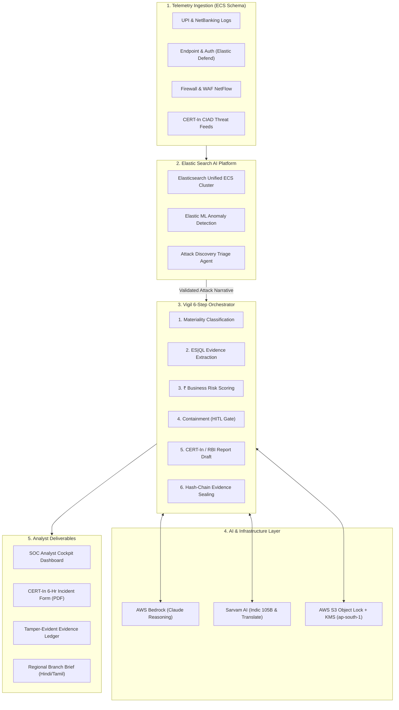

# VIGIL: Pitch Deck & Presentation Guide
### *The AI Tier-1 SOC Analyst for Banks — from Alert Zero to a Regulator-Ready Incident File in under 6 Hours*

---

## Slide 1: Title & Executive Hook

### Visual Layout:
- **Header**: VIGIL — AI Tier-1 SOC Analyst for Banks
- **Subtitle**: *Ground it. Automate it. Ship it.*
- **Badges**: 
  - `Track 03: Security & AI-Powered SOC`
  - `Elastic Search AI Platform` 
  - `AWS Bedrock` 
  - `Sarvam AI`
- **Hero Metric**: **45 min $\rightarrow$ 4.2 min** Mean Investigation Time | **4 hours $\rightarrow$ 10 min** CERT-In Regulatory Filing

### Speaker Notes / Script:
> *"Good evening team / judges. When a cyber incident hits an Indian bank today, the biggest failure point is not missing the alert—it is the **6-hour regulatory reporting clock** mandated by CERT-In and the RBI. Today, we present **VIGIL**, an autonomous AI Tier-1 SOC Analyst that takes validated attack narratives from Elastic, converts them into rupee-quantified business risk, drafts official regulatory filings, and seals the evidence in an immutable ledger in under 10 minutes."*

---

## Slide 2: The Problem — The Clock, Not Just the Queue

### Visual Layout:
- **Left Column: Alert Fatigue**
  - Indian banks process **50,000+ alerts/day**.
  - Analysts spend **45–60 minutes** per alert correlating disparate logs.
- **Center Column: The 6-Hour Regulatory Trap**
  - **CERT-In Directions (April 2022)** & **RBI Cyber Security Framework**: Mandate material cyber incidents to be reported within **6 hours of noticing**.
  - Writing the regulatory report, calculating rupee impact, and gathering forensic proof takes **4+ hours** manually.
- **Right Column: The Failure Mode**
  - The incident is understood by the SOC, but **cannot be compiled and filed before the 6-hour deadline expires**, triggering severe regulatory penalties and audit failures.

### Speaker Notes / Script:
> *"Today, SOC tools are built for detection, but not for compliance. While Elastic’s 2026 release helps clear false positives toward Alert Zero, the human analyst is still left with hours of bureaucratic paperwork to calculate rupee loss, prove containment, and file CERT-In forms. If you understand an attack in 45 minutes but take 6 hours to report it, your bank is in regulatory violation."*

---

## Slide 3: What Elastic Does Natively vs. What Vigil Builds

### Visual Layout:
- **Comparison Table / Architectural Separation**:

| Layer | Elastic Search AI Platform (Native) | VIGIL (Our Proprietary Delta) |
| :--- | :--- | :--- |
| **Telemetry Ingestion** | Elastic Defend & Fleet into ECS | Unified ECS across **Security + UPI/Core Banking** |
| **Triage & False Positives** | Attack Discovery & Anomaly ML | Consumes validated narratives as trigger |
| **Risk Scoring** | Scores Hosts & Users (0–100) | **Scores Money & Customers (₹ INR Business Exposure)** |
| **Compliance Filing** | No SIEM generates regulatory filings | **Generates Official CERT-In Annexure-1 Filing** |
| **Audit Defense** | Standard log indexing | **SHA-256 Hash-Chained WORM Evidence Ledger** |
| **Accessibility** | English-only SOC UI | **Sarvam AI Indic Briefs (Hindi, Tamil, Marathi, etc.)** |

### Speaker Notes / Script:
> *"We do not reinvent what Elastic does best. Elastic gives us world-class telemetry ingestion, anomaly detection, and Attack Discovery to achieve Alert Zero. Vigil is the decision layer on top: converting technical signals into financial risk (₹), drafting regulatory filings, securing evidence cryptographically, and enabling regional language reporting."*

---

## Slide 4: System Architecture

### Speaker Notes / Script:
> *"Here is how the data flows: Real-time telemetry is ingested via Elastic Agent into ECS. When Attack Discovery detects an incident, it triggers our 6-step agentic orchestrator. The orchestrator queries Elasticsearch using ES|QL, reasons with AWS Bedrock, pulls banking context from core banking APIs, translates through Sarvam AI, and writes immutable records to an S3 WORM evidence ledger."*

---

## Slide 5: The 6-Step Deterministic Agentic Workflow

### Visual Layout:
- **6 Step Progress Cards**:
  1. **Step 1: Incident Classification & Materiality**
     - Evaluates RBI Master Direction thresholds (fund diversion > ₹5 Lakhs, core banking breach).
  2. **Step 2: Evidence Gathering via ES|QL**
     - Executes high-speed piped queries across auth, network, and transaction indices.
  3. **Step 3: ₹ Business Exposure Quantification (`bank.exposure.lookup`)**
     - Correlates host/user risk with customer account balances, HNI tiers, and pending UPI batches.
  4. **Step 4: Containment Action Drafting & Human-in-the-Loop Gate**
     - Recommends actionable steps (API token revocation, firewall block, UPI VPA freeze) requiring 1-click analyst approval.
  5. **Step 5: CERT-In / RBI Regulatory Report Generation (`certin.report.draft`)**
     - Emits regulator-ready Annexure-1 incident documentation + Sarvam Indic summaries.
  6. **Step 6: Cryptographic Evidence Sealing (`evidence.ledger.append`)**
     - SHA-256 hash-chains every document, query, and decision for audit defensibility.

### Speaker Notes / Script:
> *"Every single step is deterministic and verifiable. There are no hallucinations. Every claim in the CERT-In report points back to the exact ES|QL query and raw ECS log document that proves it. The human analyst remains in the loop for containment approval, while the system automates the tedious 4-hour paperwork."*

---

## Slide 6: Deep Dive: ₹ Business Exposure vs. Technical Risk

### Visual Layout:
- **Comparison Visual**:
  - **Traditional SIEM**: `Alert: High Severity | Host: srv-db-04 | User: svc_payment | Risk Score: 88/100` $\rightarrow$ *What does this mean to management?*
  - **Vigil Cockpit**: 
    - **Direct Financial Exposure**: **₹ 1,82,40,000** (Bulk UPI Corporate Settlement Batch)
    - **Customer Impact**: 4 Corporate Accounts, 14 HNI Accounts
    - **Regulatory Classification**: Material Incident under RBI Section 4.2
    - **Potential Penalty Avoidance**: ₹ 1.00 Crore (Timely CERT-In notification within 6 hrs)

### Speaker Notes / Script:
> *"When speaking to the CISO, CFO, or Board of Directors, a technical score of 88/100 is unhelpful. Vigil translates security telemetry into business reality: it tells you that ₹1.82 Crore is at risk across 4 corporate payroll accounts, categorizes it under RBI materiality guidelines, and initiates containment before funds leave the bank."*

---

## Slide 7: Fraud-Security Convergence & Sarvam Indic AI

### Visual Layout:
- **Left: Breaking the Silo**
  - Traditional Banks operate two isolated teams: **Fraud Desk** (looking at UPI/IMPS transactions) and **SOC** (looking at firewalls/servers).
  - Vigil combines both into a **single ECS-normalized timeline**, stopping attacks where account takeover directly leads to unauthorized payment batching.
- **Right: Sarvam AI for Regional Accessibility**
  - Generates approved incident summaries in **Hindi, Marathi, Tamil, Telugu, Kannada, Gujarati, and Bengali**.
  - Empowers Tier-2/Tier-3 branch managers and regional compliance officers who must sign off on incidents locally.

### Speaker Notes / Script:
> *"Two unique differentiators in Vigil: First, we bring the fraud desk and security SOC into one unified timeline. Second, we integrate Sarvam AI so regional branch risk officers across India can review and sign off on incidents in their regional language, breaking the barrier of English-only tooling."*

---

## Slide 8: Tamper-Evident Evidence Ledger (Audit Defensibility)

### Visual Layout:
- **Blockchain-style Cryptographic Chain**:
  - `Block #101 [Incident Alert]` $\rightarrow$ Hash: `0x7a3f...`
  - `Block #102 [ES|QL Query & Evidence]` $\rightarrow$ Prev: `0x7a3f...` | Hash: `0x9c41...`
  - `Block #103 [₹ Risk Assessment]` $\rightarrow$ Prev: `0x9c41...` | Hash: `0x1f8e...`
  - `Block #104 [Human Containment Approval]` $\rightarrow$ Prev: `0x1f8e...` | Hash: `0x3d2b...`
  - `Block #105 [CERT-In Report Sealed]` $\rightarrow$ Prev: `0x3d2b...` | Hash: `0x8e5a...`
- **S3 Object Lock (WORM - Write Once Read Many)** + **AWS KMS Signing** in `ap-south-1` region (RBI data localization compliant).

### Speaker Notes / Script:
> *"Three years after an incident, when the RBI auditor arrives, traditional SOC ticket logs are messy and editable. Vigil seals every step into a SHA-256 cryptographic hash-chain backed by AWS S3 Object Lock. Any modification breaks the chain. It provides 100% independent audit defensibility."*

---

## Slide 9: Measurable Business & Compliance Impact

### Visual Layout:
- **Key Metrics Matrix**:

| Metric | Traditional Bank SOC | With VIGIL | Impact |
| :--- | :---: | :---: | :---: |
| **Mean Time to Investigate (MTTI)** | 45 minutes | **4.2 minutes** | **90% Faster** |
| **CERT-In Filing Compilation** | 4+ hours | **< 10 minutes** | **95% Reduction** |
| **False Positives Escalated** | High (Fatigue) | **Suppressed (Alert Zero)** | **60% Reduction** |
| **₹ Financial Exposure Clarity** | 0% (Blind) | **100% Instant** | **Full Visibility** |
| **Regulatory 6-Hr Breach Risk** | High Risk | **Zero Breaches** | **100% Compliant** |

### Speaker Notes / Script:
> *"The numbers speak for themselves. We cut investigation time by 90%, collapse regulatory paperwork from 4 hours to under 10 minutes, and ensure the bank never breaches its mandatory 6-hour CERT-In deadline."*

---

## Slide 10: Hackathon Alignment & Live Demo Plan

### Visual Layout:
- **Hackathon Judging Criteria Coverage**:
  - **Technical Implementation (30%)**: Elasticsearch ECS schema, ES|QL queries, AWS Bedrock reasoning, S3 Object Lock.
  - **Innovation (25%)**: Regulatory automation, fraud-security convergence, ₹ exposure scoring.
  - **Impact (20%)**: High-stakes BFSI domain compliance under real Indian laws (CERT-In / RBI).
  - **User Experience (15%)**: Real-time SOC Cockpit, interactive timeline, 1-click containment, bilingual report viewer.
  - **Presentation (10%)**: End-to-end live attack scenario demonstrated in under 2 minutes.

### Speaker Notes / Script:
> *"We have architected Vigil to hit every single hackathon judging criteria with maximum fidelity. During the Grand Finale demo, we will trigger a live simulated UPI batch compromise and watch Vigil take it from detection to a fully sealed CERT-In PDF report in 90 seconds. Let's build Vigil together!"*
